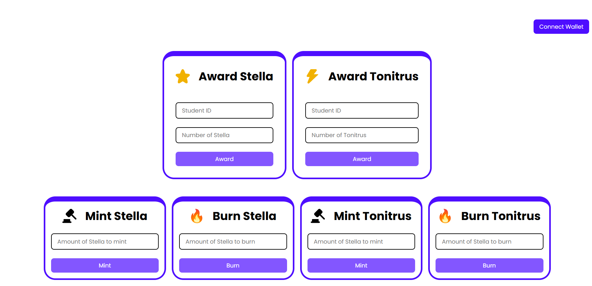
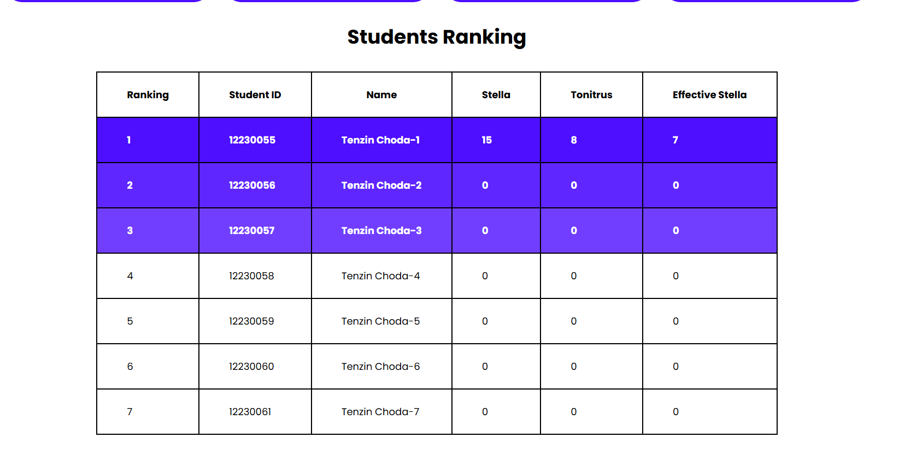

# Merit
Merit is a simple decentralized application that uses two tokens Stella(star) and Tonitrus(Thunder) to keep track of students behaviours in campus. The Stella token is meant to be awarded as a reward to students for their good deeds and the Tonitrus token is to be awarded to students for misbehaviour. The UI also displays a ranking of the students depending on their number of effective stella(i.e., number of stella - number of tonitrus). The teachers can award students with the tokens by entering the respective students studentID and the number of tokens to send. The admin/contract owner can mint new tokens as and when needed and burn unnecessary tokens.

# Project Setup
1. Clone the repository
    ```bash
    git clone https://github.com/tenze21/project-merit.git
    ```
2. Install Dependencies
    ```bash
    pnpm install
    ```
    *Note: you can install **pnpm** using npm as `npm i -g pnpm`*
3. Run project
    ```bash
    pnpm run dev
    #OR
    npm run dev
    ```
    *Vite should be listening on localhost port 5173*
4. To use your own Stella and Tonitrus token contracts just change the contract addresses in the [constants.js file.](./src/constants.js) (You can find the link to the contract repository at the bottom)
    ```javascript
    export const STELLA_CONTRACT_ADDRESS= "YOUR STELLA CONTRACT ADDRESS";
    export const TONITRUS_CONTRACT_ADDRESS= "YOUR TONITRUS CONTRACT ADDRESS";
    export const ADMIN_ADDRESS= "YOUR CONTRACT DEPLOYERS ADDRESS";
    ```

5. If you have made modifications to the contract don't forget to replace the contract ABIs in the [contracts folder.](./src/contracts/) 

# Project Dependencies
This is a vite + React(javascript) project you can learn more about vite [here.](https://vite.dev/) Apart from this the project uses viem for interfacing with web3 APIs.

**Viem** is *TypeScript* interface for ethereum and I choose it for it's extensive documentation and developer friendliness. Learn more about **viem** [here.](https://viem.sh) 

# Screenshots



# Limitations
This project doesn't entirely implement the presented idea as it was built as part of my CSB301 module project to understand the use and implementation of ERC-20 tokens. Hence, you shall find that it lacks a lot of functionalities and has been over simplified.

**Find the contract code [here.](https://github.com/tenze21/project-merit-contract.git)**